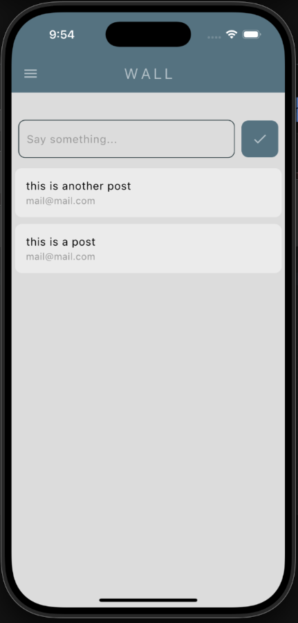

# Minimal Social Media

This project has been developed for learning purposes.

## Features

Flutter social media app using Firebase

### Core functionality

- Email auth
- Firebase database

### User interface

- Light and Dark mode
- Material design
- Users page
- Drawer for access to different pages

  
  
  
  

## Installation

1. Clone the repo
2. Setup your firebase account using the terminal
  2.1 npm install -g firebase-tools
  2.2 firebase login
  2.3 flutter pub global activate flutterfire_cli
  2.4 flutterfire configure

  If you find some ruby/gem errors try to update/reinstall ruby and/or xcodeproj
  => brew update/upgrade || brew install ruby
  => sudo gem install xcodeproj

3. In your proyect folder:
  => flutter pub add firebase_core
  => flutter pub add firebase_auth
  => flutter pub add cloud_firestore
4. Build and run

## 📄 License

This project is licensed under the MIT License - see the LICENSE file for details.

## 🤝 Contributing

Contributions are welcome! Please feel free to submit a Pull Request.
